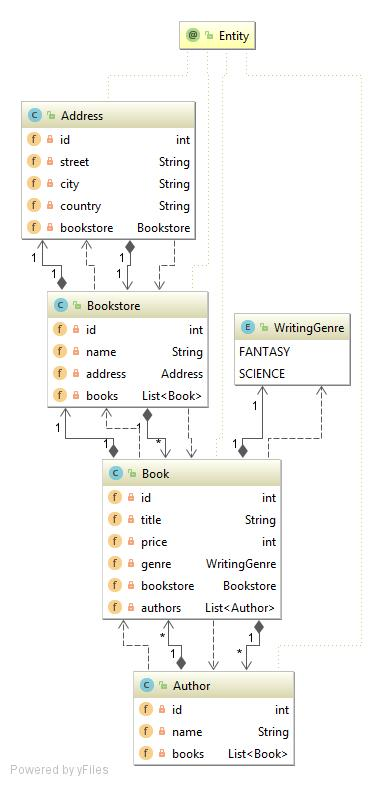

# jpa-criteria-api
## project structure

## technologies used
* Flyway - constructs the database & provide datafeed in two migrations.
Ensures data coherence by checking if schema in database is up to date:  
`org.flywaydb.core.internal.command.DbValidate validate
INFO: Successfully validated 2 migrations
org.flywaydb.core.internal.command.DbMigrate migrateGroup
INFO: Current version of schema "PUBLIC": 2
org.flywaydb.core.internal.command.DbMigrate logSummary
INFO: Schema "PUBLIC" is up to date. No migration necessary.`
* JPA 2.1
* Hibernate